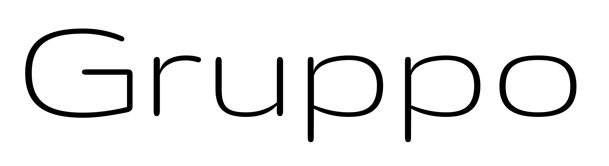

# Gruppo
By Vernon Adams

Gruppo was conceived as a display typeface for style conscious, laid-back branding where 'little is more', or, in Jasper Morrison's words, "Special is generally less useful than normal".
